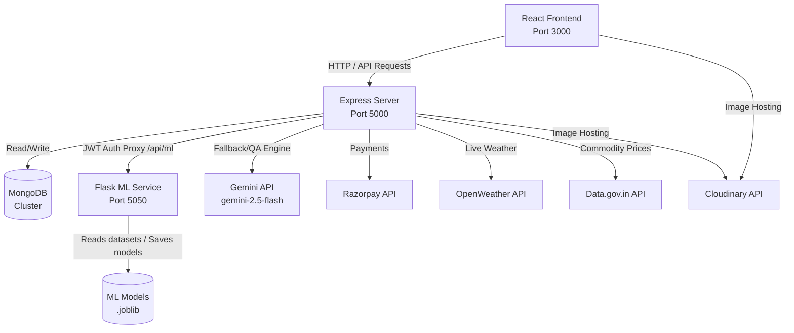

# AgroMitra 🌾

> **AgroMitra** is a premium, intelligent agricultural portal designed to empower farmers and rural merchants. It combines AI-driven crop diagnostics, smart weather advisories, a live government subsidy matcher, real-time market price caches, a peer-to-peer crop listing system, and an e-commerce shop with Razorpay integration.

---

## 👥 Project Team & Roles

AgroMitra was built and designed by a dedicated two-person development team:

* 👑 **Vrishank Raina** — *Backend & Machine Learning Lead*
  * Engineered the Node.js/Express backend framework, RESTful API routing, and security.
  * Designed the MongoDB schema patterns and index caching systems.
  * Authored the Python Flask ML service, training Random Forest classifiers and Tfidf-vectorized hybrid search engines.
  * Integrated Google OAuth, Razorpay checkout gateway, and Gemini API fallback structures.
* 🎨 **Raushan Shrivastawa** — *Frontend & UI/UX Design Lead*
  * Architected the entire client interface using React (v18).
  * Designed the premium user experience, complete with glassmorphism, harmonious color palettes, custom charts, and a responsive theme context (light/dark mode).
  * Built interactive dashboards for both farmers and administrators.
  * Integrated multilingual localized translations (i18n).
  * Shifted the Email system to Brevo for more robust clean email posting

---

## 🛠️ Microservices & Decoupled Architecture

AgroMitra uses a decoupled architecture to divide responsibilities between high-speed user queries, machine learning services, and database persistence.



### Technology Summary:
* **Frontend**: React.js, Bootstrap (v5), Custom CSS styling (vibrant color palettes, dark mode, custom fonts), React Icons.
* **Backend**: Node.js, Express.js, MongoDB + Mongoose, JWT Authentication, Passport.js (Google OAuth).
* **ML Microservice**: Python (v3.10), Flask, Scikit-Learn (Random Forest, Label Encoders), Pandas, Joblib, TF-IDF Vectorizers.
* **External APIs**: Razorpay, OpenWeatherMap, data.gov.in, Cloudinary and Gemini API.

---

## 🧠 Machine Learning Engine (`ml_service/`)

The Python Flask ML service handles prediction requests and vector searches.

### 1. Trained Classifiers (`RandomForestClassifier`)
The ML models are trained by running `python train_models.py` which pulls verified datasets from remote repositories and generates `.joblib` files in `ml_service/models/`:
* **Weather Predictor**: Classifies weather into 5 classes (`Sun`, `Rain`, `Fog`, `Snow`, `Drizzle`) based on precipitation, wind, and max/min temperatures (trained on the Seattle weather dataset).
* **Fertilizer Recommender**: Suggests optimal blends (Urea, DAP, NPK variants) based on temperature, soil moisture, humidity, NPK (Nitrogen, Phosphorous, Potassium) metrics, and crop type.
* **Crop Recommender**: Recommends high-yield crop options based on soil chemicals and rainfall (trained on Harvestify data).

### 2. Natural Language Processing & Search
* **Subsidy FAQ Assistant**: Uses a TF-IDF text similarity chatbot matching user queries to government rules in `subsidy_faqs.json`. Matches are calculated using a hybrid scoring algorithm combining Cosine similarity (TF-IDF vectorizer), string sequence ratios, and keyword tags.
* **Website QA Assistant**: Similar hybrid vectorizer indexing Express database FAQs and approved questions to guide users on platform features.

---

## ⚡ High-Resiliency Fallback Mode

If the Python Flask ML service is offline, the Node.js/Express server **automatically detects the connection failure and triggers fallback systems**:
1. **AI Chatbots**: Directly routes `/query/website` and `/query/subsidy` to the **Google Gemini API** (`gemini-2.5-flash`) using your configured API key to maintain a fully conversational support bot.
2. **Weather Advisories**: Runs local rule-based heuristics based on rain, temperature, and wind thresholds.
3. **Fertilizer Recommendations**: Queries Gemini API using soil parameters, falling back to a balanced NPK 14-35-14 rule if Gemini is also unreachable.
4. **Subsidies Matcher**: Directly reads and parses the raw local CSV dataset `ml_service/data/subsidies.csv` to calculate percentages and output scheme rules.

---

## ✨ Core Features & Visual Flows

### 🌦️ AI Weather Predictions & Advisories
* Connects to OpenWeatherMap API for live coordinates.
* Pulls a 5-day daily forecast, aggregates stats, and passes them through the ML model to output a custom agricultural advisory (e.g. warning against spraying pesticides before forecasted rain).

### 🧪 Soil Health & Diagnostics Request
* **Diagnostics Slot**: Farmers can request a soil sample pickup by selecting a date and shipping address.
* **Admin Results Logging**: Admins analyze collected soil samples and upload NPK readings, pH, moisture, and recommendations directly to the database.
* **Import to Advisor**: Farmers import NPK profiles directly into the Fertilizer Advisor tool from their profile with one click.

### 🎁 Government Subsidies & Schemes Matcher
* Scans over 80 active schemes (PM-Kisan, PM-KUSUM, Rythu Bandhu, etc.).
* Calculates custom percentage matching scores based on a farmer's state, crop, land acres, and annual income.

### 🤝 Peer-to-Peer Crop Listings
* Farmers can list their crops/seeds for sale, complete with Cloudinary hosted images.
* Listings go through an Admin approval queue to ensure quality control and prevent spam.

### 🛒 Shop & E-Commerce
* Custom database-backed product catalogs.
* Razorpay payment gateway checkout integration.
* Order history dashboard with review/rating controls limited only to verified buyers of delivered products.

### 🔒 Admin Security Console
* Logs security audit events, analyst session details, user banning/unbanning controls, shop product CRUD, and soil diagnostics logs.

---

## 🔌 API Endpoints Reference

### 👤 Authentication (`/`)
* `POST /request-otp` — Sends verification code for signup.
* `POST /verify-otp` — Verifies code and registers the user.
* `POST /signin` — Sign in using credentials.
* `GET /auth/google` — Redirect to Google OAuth registration.
* `POST /logout` — Ends user session and invalidates JWT token. *(Auth Required)*

### 🌾 Crop Marketplace & Mandi (`/api/crops`)
* `GET /api/crops` — Get active crop listings. *(Auth Required)*
* `POST /api/crops` — Create a crop listing. *(Auth Required)*
* `POST /api/crops/upload` — Upload crop image to Cloudinary. *(Auth Required)*
* `GET /api/crops/categories` — Get crop categories. *(Auth Required)*
* `GET /api/crops/mandi-prices` — Get cached mandi commodity prices. *(Auth Required)*
* `GET /api/crops/mandi-states` — Get state lists currently cached. *(Auth Required)*
* `DELETE /api/crops/:id` — Delete a marketplace listing. *(Auth Required)*

### 🧪 Soil Testing Service (`/api/soil`)
* `POST /api/soil/request` — Request soil pickup slot. *(Auth Required)*
* `GET /api/soil/my-requests` — Get soil report logs for the active user. *(Auth Required)*

### 🌦️ Weather API (`/api/weather`)
* `GET /api/weather/live` — Get current live weather stats. *(Auth Required)*
* `GET /api/weather/weekly` — Get weekly forecast matched with ML advisories. *(Auth Required)*

### 🛒 E-Commerce & Payments (`/api/products` & `/api/payment`)
* `GET /api/products` — Retrieve in-stock catalog. *(Auth Required)*
* `PUT /api/products/:id/rate` — Submit product rating. *(Auth Required, verified order only)*
* `POST /api/products/:id/review` — Add product review comment. *(Auth Required, verified order only)*
* `POST /api/payment/order` — Create Razorpay purchase order. *(Auth Required)*
* `POST /api/payment/verify` — Verify signatures and record purchase. *(Auth Required)*
* `GET /api/payment/my-orders` — View user transaction history. *(Auth Required)*

### 🛠️ Admin Panel (`/api/admin`) *(Admin Authorization Required)*
* `GET /api/admin/users` — View all registered users.
* `PUT /api/admin/users/:id/ban` — Ban/unban a user.
* `GET /api/admin/logs` — View system audit logs.
* `GET /api/admin/soil-requests` — View soil diagnostic slots.
* `PUT /api/admin/soil-requests/:id` — Complete report and save NPK parameters.
* `GET /api/admin/orders` — View all store transactions.
* `PUT /api/admin/orders/:id` — Update shipment states.
* `GET /api/admin/products` — Manage products catalog.
* `POST /api/admin/products` — Create new shop product.
* `POST /api/admin/products/upload` — Upload product photo to Cloudinary.
* `PUT /api/admin/products/:id` — Update catalog details.
* `DELETE /api/admin/products/:id` — Delete product from store.
* `GET /api/admin/crops` — List crop marketplace items.
* `PUT /api/admin/crops/:id/approval` — Moderate/approve a listing.
* `PUT /api/admin/categories` — Modify category metadata.

---

## 📂 Project Directory Structure

```text
agromitra-ML/
├── client/                     # React Frontend App
│   ├── public/                 # Static assets, HTML root template
│   ├── src/
│   │   ├── components/         # Page templates (Admin, Dashboard, Shop, etc.)
│   │   ├── context/            # Global context providers (Theme, Auth, Language)
│   │   ├── styles/             # Modular page styling stylesheets
│   │   ├── App.js              # Application router config
│   │   └── index.css           # Global CSS variables & layout design
│   └── .env                    # Client environment settings
├── ml_service/                 # Flask Machine Learning Service
│   ├── data/                   # Datasets (Weather, Subsidies CSVs, FAQs JSONs)
│   ├── models/                 # Saved Random Forest models (.joblib)
│   ├── app.py                  # Flask endpoints & hybrid search vectorizers
│   ├── train_models.py         # Pulls training data and compiles models
│   └── requirements.txt        # Python dependency packages
├── server/                     # Express Backend Microservice
│   ├── config/                 # Passport strategies config
│   ├── controllers/            # Controller routers & operations logic
│   ├── middleware/             # Route validators (JWT token checker)
│   ├── models/                 # Mongoose schemas (Products, User, Orders, Soil)
│   ├── routes/                 # Endpoint path bindings
│   ├── utils/                  # Helper modules (data caches)
│   ├── index.js                # Server entrypoint & DB connection/seeder
│   └── .env                    # Main system environment variables
├── README.md                   # Project documentation
└── LICENSE                     # Open source license
```

---

## ⚙️ Environment Configuration

Ensure you create `.env` files in their respective folders with the following parameters:

### Server Environment Config (`server/.env`)
```env
PORT=5000
MONGO_URI=your_mongodb_connection_string
JWT_SECRET=your_jwt_signing_token
SESSION_SECRET=your_session_secret_key

# External Services
GEMINI_API_KEY=your_google_gemini_key
OPENWEATHER_API_KEY=your_openweathermap_api_key
DATA_GOV_API_KEY=your_indian_open_data_api_key

# Image Storage (Cloudinary)
CLOUDINARY_CLOUD_NAME=your_cloud_name
CLOUDINARY_API_KEY=your_cloudinary_api_key
CLOUDINARY_API_SECRET=your_cloudinary_secret

# Razorpay Sandbox Credentials
RAZORPAY_KEY_ID=your_razorpay_key_id
RAZORPAY_KEY_SECRET=your_razorpay_key_secret
```

### Client Environment Config (`client/.env`)
```env
REACT_APP_API_URL=http://localhost:5000
REACT_APP_RAZORPAY_KEY_ID=your_razorpay_key_id
```

---

## 🚀 Setup & Launch Steps

### 1. Download Datasets & Train AI Models
Ensure Python 3.10+ is installed:
```bash
cd ml_service
pip install -r requirements.txt
python train_models.py
```

### 2. Start ML Flask API
```bash
python app.py
# Runs ML services locally on port 5050
```

### 3. Initialize Express Server
```bash
cd ../server
npm install
npm start (or node index.js)
# Runs Express server on port 5000. Auto-seeds defaults on connection.
```

### 4. Build/Run React Frontend
```bash
cd ../client
npm install
npm start
# Launches the browser interface locally on port 3000
```
*(Alternatively, run `npm run build` inside `client/` and allow the Node backend server to serve the client index statically on port 5000).*
